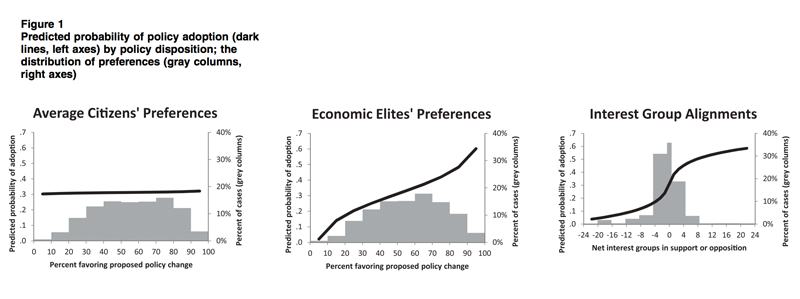

# MyGov | An app by the people, for the people.

Note: MyGov is currently in pre-alpha development. MVP alpha deployments for iOS and web are tentatively scheduled for the beginning of June 2017. Only the bill tracking features shown in the first two GIFs below will be available in the alpha release, but additional features will soon follow. Take a look at the [living MyGov prototype](https://invis.io/VJ9VWH3SG#/212448806_Login_Screen) to get a peek at what is coming next!

## Intro

MyGov is an open-source, 100% transparent, non-partisan American political engagement app for Android, iOS, and the web. It is MyGov's goal to create a more engaged and informed American public, and to make the American government more responsive to the will of the people. Using MyGov you can:
* Browse all of the proposed bills in Congress based on progress, topic, and status.
* Get notifications about activity surrounding legislation or political officials.
* Vote on and share your opinion on key political issues.
* Easily identify and contact your representatives.
* Learn about the American political system from a completely non-biased perspective.

MyGov makes keeping up with Congress and voicing your opinion on legislation easy and meaningful. Enter in your voting address to identify your representatives, then choose categories of legislation that you care about. View all of the bills proposed by Congress and track them along their journey to becoming law. Follow a bill that you are especially invested in to receive notifications when the bill's status changes. Easily and effectively voice your opinion about a bill by using the bill's 'take action' button. The best representative to contact about a bill will change depending on the status of the bill. The 'take action' button does the hard work for you by showing you which representative you need to contact and by offering multiple ways to contact the representative right from the app.

 

## Download MyGov

Web - alpha release scheduled for 6/1/17

iOS - alpha release scheduled for 6/1/17

Android - alpha release scheduled for 7/1/17

## MyGov's Mission

It is MyGov's mission to nurture an American public that is more informed, engaged, and knowledgeable when it comes to the topic of American politics.

## The Why

MyGov was originally conceived in response to a [video](https://www.youtube.com/watch?v=5tu32CCA_Ig) released by the organization [Represent.us](https://represent.us/) that highlighted a [Princeton study](https://scholar.princeton.edu/sites/default/files/mgilens/files/gilens_and_page_2014_-testing_theories_of_american_politics.doc.pdf) that showed that there was almost no correlation between public opinion of legislation and its probability of becoming law. The study did show a much stronger correlation between the wants of the top 10% of income earners and interest groups, and bills becoming law.

To quote the study:

>The estimated impact of average citizens’ preferences drops precipitously, to a non-significant, near-zero level. Clearly the median citizen or “median voter” at the heart of theories of Majoritarian Electoral Democracy does not do well when put up against economic elites and organized interest groups.

Represent.us identified corruption and money in politics as one of the main drivers of the impact disparity shown above. If you are interested in taking part in the anti-corruption effort we highly suggest you check out their movement.

MyGov approaches this problem from a different angle. Where Represent.us focuses on making the voice of money and corporations in government quieter, MyGov focuses on making the voice of the average citizen louder.

## The How

MyGov has three primary goals to achieve its mission of creating a healthier democracy. They are:

1. Help users become more knowledgeable about the American political system as a whole.
2. Help users stay informed and updated on the American politics.
3. Help users share their opinions on political issues with their peers and representatives.

### Details

##### 1) Political Knowledge
When talking about 'political knowledge' we are referring to knowledge of how the American political system works in general. This includes things like how a bill becomes law, how cases make it to the Supreme Court, what powers each of the branches of American government has, and how checks and balances work. MyGov strives to increase political knowledge in three ways:

* Design a UI that depicts political systems in a way that is intuitive and easy to understand.
* Implement graduation cap icons that can be clicked to learn more about a particular screen or feature of government. (Much like the Google Analytics implementation)
* Link to or embed quality external resources from reputable sources for additional learning.

##### 2) Staying informed
It is important that citizens not only be knowledgeable about the American political system as a whole, but that they also stay informed on current political issues and legislation. MyGov seeks to create a more informed public by:

* Scouring the web to compile, maintain, and frequently update an accurate and robust political activity database.
* Displaying political activity in an intuitive and easy to consume way.
* Designing a UI that focuses on the political activities that are most important.
* Allowing users to follow and receive updates on individuals, groups, and pieces of legislation.

##### 3) Getting engaged
MyGov strives to make it as easy as possible for its knowledgeable and informed users to engage in politics with their peers and representatives. MyGov assists with political engagement by:

* Allowing users to vote approving or disapproving of individuals, groups, or pieces of legislation.
* Allowing users to comment on political activity.
* Allowing users to share app information with their social networks.
* Making it easy to identify and contact representatives.
* Highlighting the key officials that issues pertain to.

In addition to the primary goals that focus on the American public, MyGov also strives to provide value to representatives by:

1. Providing valuable information about the will of their constituents.
2. Assisting with communication to constituents.
3. Verifying accounts and normalizing poll numbers to provide the most objectively correct numbers possible.

## Contributing

At this early stage of development I would ask that you contact me directly at ianclancaster@gmail.com if you are interested in contributing. I will be setting up more developed contribution guidelines as the app matures.
